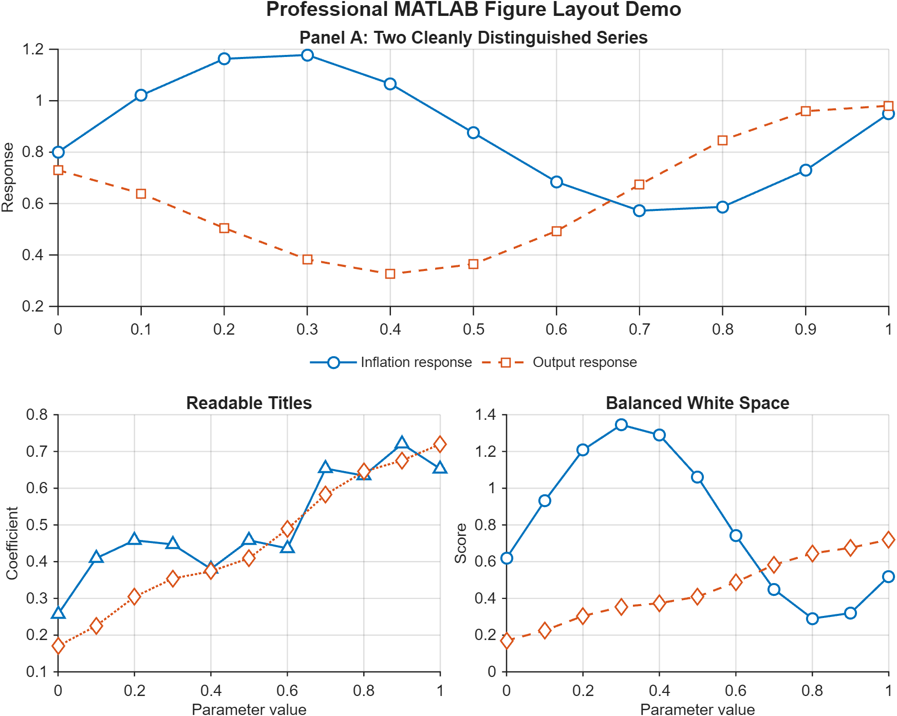

# Publication-Quality MATLAB Figures

`matlab-plot-skill` is a reusable skill for Codex and Claude Code that fixes messy MATLAB figures: cramped layouts, unreadable titles, awkward legends, bad white space, and weak PDF output for LaTeX or Overleaf.

The key rule is simple: the agent must not stop after writing plotting code. It must generate the figure, export it, read the rendered figure itself, and iterate until the visual result is no longer a mess.



## Find This Repo If You Searched For

- how to make MATLAB figures look professional
- publication-quality MATLAB plots
- fix messy subplot layout in MATLAB
- export MATLAB figure to PDF for LaTeX
- MATLAB figures for Overleaf
- improve MATLAB legend, title, spacing, and white space

## What Problem This Solves

- multi-panel MATLAB figures that look cramped or amateurish
- legends that steal too much plot area
- titles that are too long or too small after PDF scaling
- inconsistent colors and symbols across panels
- plots that look acceptable in MATLAB but bad once embedded in a paper

## What This Skill Enforces

- MATLAB-first figure cleanup for papers, appendices, and slides
- vector PDF export for LaTeX and Overleaf workflows
- better layout choices for multi-panel figures
- explicit render-review-iterate behavior
- reusable MATLAB export helper code
- a quick PNG review path so the agent can read the rendered figure easily

## Repository Layout

- [`matlab-plot-skill/SKILL.md`](./matlab-plot-skill/SKILL.md)
- [`matlab-plot-skill/scripts/export_publication_figure.m`](./matlab-plot-skill/scripts/export_publication_figure.m)
- [`matlab-plot-skill/references/render_review_checklist.md`](./matlab-plot-skill/references/render_review_checklist.md)
- [`matlab-plot-skill/references/matlab_figure_guidelines.md`](./matlab-plot-skill/references/matlab_figure_guidelines.md)
- [`matlab-plot-skill/agents/openai.yaml`](./matlab-plot-skill/agents/openai.yaml) (Codex UI metadata)
- [`install.ps1`](./install.ps1)
- [`install.sh`](./install.sh)
- [`examples/demo_publication_figure.m`](./examples/demo_publication_figure.m)
- [`examples/output/demo_publication_figure.png`](./examples/output/demo_publication_figure.png) (committed preview image)
- [`tools/validate_repo.py`](./tools/validate_repo.py)
- [`LICENSE`](./LICENSE), [`CITATION.cff`](./CITATION.cff)

## Prerequisites

- MATLAB R2021a or newer. The export helper uses `exportgraphics` (R2020a+) and an `arguments` block (R2019b+); the demo and the documented helper calls use name=value argument syntax (`WidthInches=8.4`), which requires R2021a+.
- For repo validation only: `uv` (or Python 3 with `pyyaml`).

## Install

Clone the repo first (the installers run from the clone):

```bash
git clone https://github.com/hanlulong/matlab-plot-skill.git
cd matlab-plot-skill
```

### Windows PowerShell

Install into both Codex and Claude Code skill directories:

```powershell
.\install.ps1
```

Install only into Codex:

```powershell
.\install.ps1 -Target codex
```

Overwrite an existing installed copy:

```powershell
.\install.ps1 -Force
```

### macOS / Linux

```bash
./install.sh
```

Install only into Claude Code:

```bash
./install.sh --target claude
```

## Manual Install

Copy the [`matlab-plot-skill`](./matlab-plot-skill) folder into one or both of these locations:

- Codex: `~/.agents/skills/matlab-plot-skill` (Codex releases before 2026 used `~/.codex/skills`)
- Claude Code: `~/.claude/skills/matlab-plot-skill`

## Example Invocation

Use prompts like:

```text
Use $matlab-plot-skill to refactor Plots/generate_my_figure.m into a publication-quality PDF figure. Read the exported figure and the compiled paper page, then iterate until the spacing and titles are clean.
```

```text
Use $matlab-plot-skill to improve this MATLAB appendix figure. Keep the color mapping fixed across panels, distinguish variants with markers, export a vector PDF, and read the generated figure yourself before stopping.
```

## Demo Example

Run this from the repository root (the path is relative to MATLAB's working directory):

```bash
matlab -batch "run('examples/demo_publication_figure.m')"
```

This generates:

- `examples/output/demo_publication_figure.pdf`
- `examples/output/demo_publication_figure.png`

The PNG is there for fast review. The PDF is the publication-style export for the paper workflow. Only the PNG (used as the preview above) is committed; the vector PDF is git-ignored and produced locally when you run the demo.

## Validation

`tools/validate_repo.py` is an optional local check (it is not run by CI). Run it before contributing:

```bash
uv run --with pyyaml python tools/validate_repo.py .
```

(Or `pip install -r requirements-dev.txt` first, then `python tools/validate_repo.py .`.)

This checks:

- required skill packaging files, including the committed demo PNG
- `SKILL.md` front matter and that the body still expresses the render-review-iterate workflow
- the export helper still uses `exportgraphics` vector output, and the demo still calls that helper
- relative markdown links resolve
- `openai.yaml` skill metadata
- PowerShell install flow (when PowerShell is available)
- bash install flow (when bash is available)

## Making Changes

1. If you change the MATLAB code, lint it locally: `matlab -batch "checkcode('matlab-plot-skill/scripts/export_publication_figure.m')"` (and the demo).
2. If you change the demo, re-run it with MATLAB and re-commit `examples/output/demo_publication_figure.png` (the committed preview image).
3. Run the validator above before committing.

## Notes

- Codex reads [`agents/openai.yaml`](./matlab-plot-skill/agents/openai.yaml) for optional UI metadata.
- Claude Code can use the same `SKILL.md`-based folder structure.
- The installer copies the skill, so re-run it with `--force` (`-Force` on PowerShell) after you update the repo to refresh the installed copy.
- Restart your Claude Code or Codex session after installing so the new skill is picked up.
